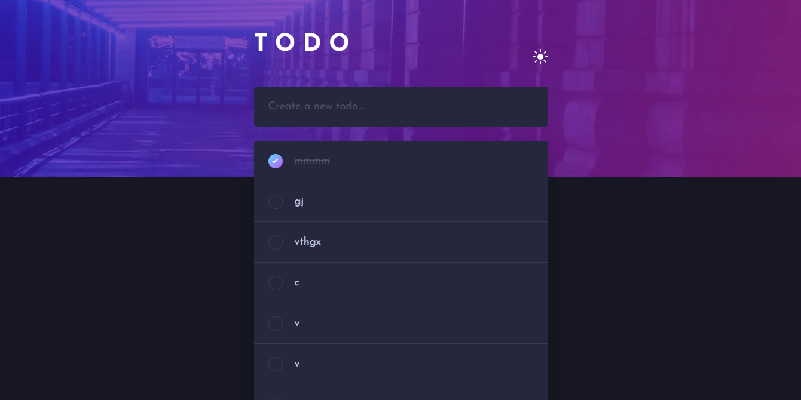

# Frontend Mentor - Todo app solution

This is a solution to the [Todo app challenge on Frontend Mentor](https://www.frontendmentor.io/challenges/todo-app-Su1_KokOW). Frontend Mentor challenges help you improve your coding skills by building realistic projects. 

## Table of contents

- [Overview](#overview)
  - [The challenge](#the-challenge)
  - [Screenshot](#screenshot)
  - [Links](#links)
- [My process](#my-process)
  - [Built with](#built-with)
  - [AI Collaboration](#ai-collaboration)


## Overview

### The challenge

Users should be able to:

- View the optimal layout for the app depending on their device's screen size
- See hover states for all interactive elements on the page
- Add new todos to the list
- Mark todos as complete
- Delete todos from the list
- Filter by all/active/complete todos
- Clear all completed todos
- Toggle light and dark mode
- **Bonus**: Drag and drop to reorder items on the list

### Screenshot



### Links

- Solution URL: [visit](https://www.frontendmentor.io/solutions/todo-app-8MNuVGSeQt)
- Live Site URL: [visit](https://johnpraise247.github.io/todo/)

## My process

### Built with

- Semantic HTML5 markup
- CSS custom properties
- Mobile-first workflow
- [Mithril](https://mithril.js.org/) - JS library
- [DaisyUI](https://daisyui.com/?lang=en) - For styles


### AI Collaboration


- Claude, GitHub Copilot
- Brainstorming solutions and generating code


---

## Running Locally

Run with a Local Development Server 

Using a local server avoids potential issues with module loading and file paths.

#### Using VS Code Live Server

1. Install the **Live Server** extension in VS Code.
2. Open the project folder in VS Code.
3. Right-click `index.html`.
4. Click **"Open with Live Server"**.

#### Using Node (http-server)

If you have Node.js installed:

```bash
npx serve .
```

or

```bash
npx http-server .
```

Then open the local URL shown in your terminal (usually `http://localhost:3000` or similar).

---
